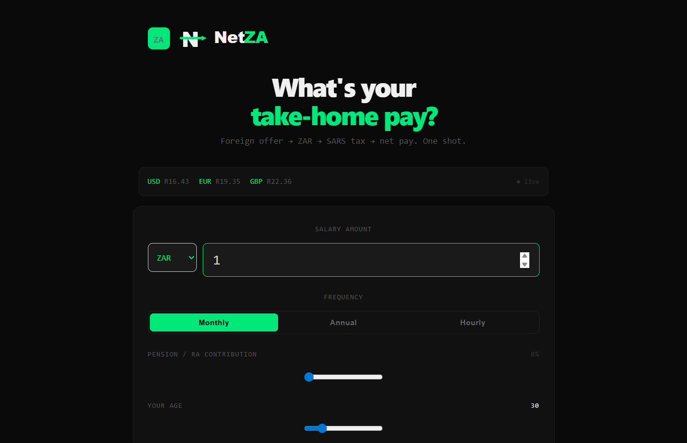

# NetZA — SA Salary Calculator



> **Foreign offer → ZAR → SARS tax → net pay. One shot.**

NetZA is a free, open salary calculator built specifically for South Africans — especially those receiving job offers in foreign currencies (USD, EUR, GBP). Instead of bouncing between a currency converter, a spreadsheet, and TaxTim, NetZA does everything in one place.

---

## ✨ Features

- 💱 **Live exchange rates** — USD, EUR, GBP → ZAR via open.er-api.com (with ZAR fallback if offline)
- 🧮 **SARS 2026/2027 tax brackets** — accurate PAYE calculation baked in
- 🏦 **UIF deduction** — 1% employee contribution, correctly capped at R177.12/month
- 🧾 **Pension / RA slider** — pre-tax deduction up to 27.5%, reducing your taxable income
- 👴 **Age-based rebates** — primary (under 65), secondary (65–74), tertiary (75+)
- ⏱ **Frequency modes** — enter salary as Hourly, Monthly, or Annual
- ☕ **PayFast support** — built-in "buy me a coffee" with ZAR-native payments

---

## 🚀 Getting Started

### Prerequisites

- [Node.js](https://nodejs.org/) v18 or higher
- npm v9 or higher

### Installation

```bash
# 1. Clone the repo
git clone https://github.com/yourusername/netza.git
cd netza

# 2. Install dependencies
npm install

# 3. Start the dev server
npm run dev
```

The app will be running at **http://localhost:5173**

---

## 🏗 Project Structure

```
netza/
├── public/
│   ├── favicon.ico          # Multi-size favicon (16–256px)
│   ├── favicon-32.png       # PNG favicon for modern browsers
│   ├── apple-touch-icon.png # iOS home screen icon (180×180)
│   ├── favicon-192.png      # Android / PWA icon
│   └── logo.svg             # NetZA wordmark
├── src/
│   ├── App.jsx              # Main UI component
│   ├── taxEngine.js         # SARS tax logic (PAYE, UIF, rebates)
│   ├── useExchangeRates.js  # Live exchange rate hook
│   ├── PayFastButton.jsx    # PayFast donation component
│   ├── index.css            # Global styles
│   └── main.jsx             # React entry point
├── index.html
├── vite.config.js
└── package.json
```

---

## 🧾 Tax Logic

Tax calculations follow **SARS 2026/2027** rules:

| Component | Detail |
|---|---|
| PAYE | 7 progressive brackets from 18% to 45% |
| Primary rebate | R17,820 (all taxpayers under 65) |
| Secondary rebate | R9,756 (age 65–74) |
| Tertiary rebate | R3,240 (age 75+) |
| UIF | 1% of gross, capped at R177.12/month |
| Pension / RA | Pre-tax deduction, max 27.5% of gross |

> All calculations are estimates. Not financial advice. Consult a tax professional for your specific situation.

---

## 💳 PayFast Setup

The app includes a built-in donation button powered by [PayFast](https://payfast.io) — ZAR-native, no account needed for supporters.

**To activate payments:**

1. Sign up at [payfast.io](https://payfast.io) as a Merchant
2. Go to **Settings → Integration** in your dashboard
3. Open `src/PayFastButton.jsx` and replace:

```js
const MERCHANT_ID  = 'YOUR_MERCHANT_ID'
const MERCHANT_KEY = 'YOUR_MERCHANT_KEY'
```

**To test with PayFast sandbox before going live:**

```js
const MERCHANT_ID  = '10000100'
const MERCHANT_KEY = '46f0cd694581a'
const PAYFAST_URL  = 'https://sandbox.payfast.co.za/eng/process'
```

---

## 🏗 Build for Production

```bash
npm run build
```

Output goes to `/dist` — ready to deploy on Vercel, Netlify, or any static host.

### Deploy to Vercel (recommended)

```bash
npm i -g vercel
vercel
```

### Deploy to Netlify

```bash
npm i -g netlify-cli
netlify deploy --prod --dir=dist
```

---

## 🖼 Logo & Branding

| Asset | File | Usage |
|---|---|---|
| Wordmark SVG | `public/logo.svg` | Navbar / header |
| Favicon ICO | `public/favicon.ico` | Browser tab |
| Apple Touch | `public/apple-touch-icon.png` | iOS home screen |
| Android Icon | `public/favicon-192.png` | PWA / Android |

**Colour palette:**

| Name | Hex |
|---|---|
| Green (accent) | `#00e87a` |
| Off-white (text) | `#f0f0f0` |
| Near-black (bg) | `#0a0a0a` |

---

## 🛣 Roadmap

- [ ] Shareable URL with salary encoded in query params
- [ ] Copy result to clipboard
- [ ] Medical aid deduction support
- [ ] Side-by-side offer comparison
- [ ] PWA / offline support

---

## 📄 License

MIT — free to use, fork, and build on.

---

<p align="center">
  NetZA · Made with ❤️ in 🇿🇦 South Africa
</p>
